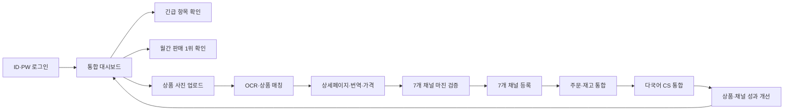

# SellerPilot 멀티채널 커머스 운영센터 스토리보드

- 버전: 1.0
- 작성일: 2026-08-15
- 대상 채널: Qoo10 Japan, Shopee Singapore, Lazada Malaysia, 쿠팡, 11번가, 네이버 스마트스토어, eBay
- 핵심 사용자: 대표/총괄 관리자, 상품 운영자, 주문·출고 담당자, CS 담당자
- 서비스 목표: 상품 등록부터 판매·주문·재고·CS까지 흩어진 채널 운영을 하나의 화면에서 판단하고 실행한다.

## 1. 제품 한 문장

사진 한 장으로 여러 글로벌 마켓의 판매 준비를 만들고, 등록 이후의 매출·주문·재고·CS까지 한 화면에서 운영하는 AI 커머스 운영센터.

## 2. 핵심 사용자 과제

1. 여러 판매 채널을 오가느라 오늘의 전체 상황을 파악하기 어렵다.
2. 같은 상품 정보와 이미지를 채널별 규격에 맞춰 반복 입력한다.
3. 등록 실패, 품절 위험, 미답변 CS가 각 채널에 흩어져 늦게 발견된다.
4. 어떤 상품과 채널에 집중해야 매출이 늘어나는지 비교가 어렵다.
5. 언어가 다른 고객 문의에 빠르고 일관되게 답변하기 어렵다.

## 3. 핵심 사용자 여정

## 4. 장면별 스토리보드

| 장면 | 화면 | 사용자 행동 | 시스템 반응 | 완료 기준 |
|---|---|---|---|---|
| 01 | 로그인 | ID와 비밀번호 입력 | 계정 검증 후 운영센터로 이동 | 권한에 맞는 첫 화면 진입 |
| 02 | 통합 대시보드 | 기간을 선택하고 핵심 지표 확인 | 총매출, 주문, 등록, CS와 이전 기간 대비 변화 표시 | 30초 안에 오늘 할 일 결정 |
| 03 | 월간 상품 TOP 10 | 판매 1위부터 10위까지 순위와 채널별 기여 확인 | 대표 이미지, 판매량, 매출, 판매 채널 표시 | 집중 판매할 상품 파악 |
| 04 | 상품 등록 | 대표사진 1장과 정면·후면·좌우·라벨·바코드 등 옵션 사진, 상품 설명과 참고 링크 입력 | 모든 이미지의 OCR·바코드와 입력 텍스트·공개 링크 정보를 교차분석 | 분석 대기열에 안전하게 저장 |
| 05 | AI 자동 가공 | 자동화 옵션과 등록 채널 선택 | 사실정보 보호, 다국어 번역, 상세페이지와 가격 생성 | 채널별 등록 초안 완성 |
| 06 | 마진 계산 | 원가·물류비·세금·광고비·목표 마진 입력, 채널 선택 | 채널 수수료·결제비·환율을 반영해 순이익, 손익분기점, 권장 판매가와 자동 등록 판정 표시 | 팔아도 남는 가격과 채널 결정 |
| 07 | 채널 동시 등록 | 검증 결과 확인 또는 자동 게시 허용 | Qoo10, Shopee, Lazada, 쿠팡, 11번가, 네이버 스마트스토어, eBay별 속성으로 변환·등록 | 성공·대기·오류가 상품 단위로 추적됨 |
| 08 | 주문·판매 | 결제·출고·배송 상태 확인, 일괄 출고 | 채널 주문 정규화와 중앙 재고 예약 | 중복 판매와 품절 위험 최소화 |
| 09 | CS 통합함 | 문의 선택, AI 답변 초안 검토·전송 | 자동번역, 주문 정보와 정책을 반영한 답변 생성 | SLA 내 일관된 답변 완료 |
| 10 | 채널별 페이지 | 채널의 매출·전환율·상품·CS 점검 | 스토어 건강도와 개선 항목 표시 | 채널별 운영 액션 결정 |
| 11 | 상품 관리 | 재고·판매·등록 상태로 필터링 | 중앙 상품 원장과 채널 상태를 함께 표시 | 품절·오류·저성과 상품 처리 |

## 5. 화면 정보 구조

### 5.1 로그인

- ID, 비밀번호, 로그인 상태 유지
- 비밀번호 표시·숨김
- 계정 복구와 운영 지원 진입점
- 운영센터 가치와 연결 채널 상태를 함께 안내
- 현재 구현은 화면 검증용 데모 로그인이다. 실서비스에서는 서버 인증, 비밀번호 해시, 세션 만료, 로그인 시도 제한, 2단계 인증과 역할 기반 권한을 적용한다.

### 5.2 통합 대시보드

- 기간: 7일, 30일, 90일
- KPI: 총매출, 주문, 등록 완료, CS 응답률
- 이번 달 판매 TOP 10: 1위부터 10위까지 대표 이미지, 판매량, 매출, 판매 채널
- 채널별 운영 현황: 매출, 주문, 성장률, API 연결 상태
- 상품 등록 파이프라인: AI 분석, 등록 대기, 완료, 확인 필요
- 긴급 항목: 재고 부족, 등록 실패, 장기 미답변 CS
- 빠른 실행: 새 상품 등록, 출고 처리, AI 답변

### 5.3 상품 관리

- 중앙 상품 ID, SKU, 이미지, 상품명
- 7개 판매 채널 등록 여부
- 중앙 재고, 30일 판매량과 매출
- 판매중, 재고주의, 품절, 등록오류 상태
- 검색, 채널·상태 필터, 선택 작업, 동기화

### 5.4 상품 등록 센터

- 채널 목록과 검색 결과에 사용할 대표사진 1장 필수
- 정면, 후면, 좌측면, 우측면, 상단, 하단, 성분·라벨, 바코드 옵션 사진 슬롯
- 상세컷·구성품·포장 사진의 다중 추가 업로드
- 상품 용도·재질·구성·특징을 입력하는 1,000자 간략 설명
- 로그인 없이 접근 가능한 제조사·공급사·공식 상품 참고 링크
- 대표사진을 기준으로 옵션 사진, 설명, 공개 링크의 정보를 교차검증하고 충돌 정보는 확인 필요로 분류
- 등록 채널 선택
- 다국어 번역, 마진 기반 가격, 검증 통과 시 자동 등록 옵션
- 오늘의 작업 대기열과 단계별 상태
- 신뢰도 97% 이상 자동 진행, 85~97% 재촬영 요청, 85% 미만 또는 규제 정보 부족 시 자동 제외

### 5.5 마진 계산

- 상품 계획 판매가, 시장 참고가와 건당 매입·국제배송·현지배송·포장·통관 원가 입력
- Qoo10, Shopee, Lazada, 쿠팡, 11번가, 네이버 스마트스토어, eBay 채널별 플랫폼·결제 수수료 적용
- 매출 연동 세금, 광고·쿠폰 부담, 반품·분실 충당률과 목표 마진 입력
- 주문 1건 예상 순이익, 마진율, 손익분기 판매가와 목표 마진 권장 판매가 실시간 계산
- 동일 상품의 7개 채널 수익성과 현지 통화 판매가 비교
- 목표 마진과 시장 참고가를 함께 반영한 자동 등록 가능·가격 조정·마진 확인 판정
- 현재 화면은 샘플 수수료·환율을 사용하며 실서비스에서 적용 기간별 가격 규칙 API로 교체

### 5.6 주문·판매

- 채널 통합 주문 목록
- 결제완료, 출고대기, 배송중, 완료·취소 탭
- 주문번호, 구매자, 상품, 결제통화, 상태, 주문시간
- 선택 주문 일괄 출고와 송장 업로드
- 중앙 재고 예약과 채널 표시 재고 동기화

### 5.7 CS 통합함

- 채널 전체의 미답변·처리중·완료 문의
- 고객 메시지 자동 번역과 원문 확인
- 현재 주문·배송·고객 구매 이력 문맥
- 운영 정책 기반 AI 답변 초안
- 발송 언어 선택, 템플릿, 답변 전송
- 평균 첫 응답, 24시간 해결률, AI 초안 사용률

### 5.8 채널별 페이지

- 매출, 주문, 판매 상품, CS 응답률
- 매출·주문 추이와 평균 객단가, 전환율, 광고 ROAS, 반품률
- 스토어 건강도: 상품 정보, 배송 SLA, CS 품질, 재고 안정성
- 채널 내 판매 상품 순위
- API 상태와 마지막 동기화 시각

## 6. 디자인 시스템

### 채택 기준

- shadcn/ui: GitHub에서 높은 채택도를 가진 MIT 오픈소스 UI·컴포넌트 배포 체계의 정보 구조와 접근성 패턴을 적용한다.
- Lucide: ISC 라이선스의 일관된 오픈소스 아이콘을 사용한다.
- Geist: 숫자와 상태를 빠르게 읽을 수 있는 인터페이스 타이포그래피로 사용한다.

### 시각 원칙

1. 왼쪽 고정 탐색, 상단 검색, 오른쪽 알림으로 어디서든 다음 작업을 찾는다.
2. 흰 카드와 낮은 명도의 회색 배경으로 데이터 밀도를 유지한다.
3. 보라색 하나를 주 강조색으로 사용하고, 초록·주황·빨강은 상태 전달에만 사용한다.
4. Qoo10, Shopee, Lazada, 쿠팡, 11번가, 네이버 스마트스토어, eBay는 문자 마크와 채널 고유색을 일관되게 사용한다.
5. KPI는 숫자, 변화율, 비교 기준을 한 묶음으로 표시한다.
6. 실패·빈 상태·대기 상태도 정상 화면과 같은 수준으로 설계한다.
7. 데스크톱 운영을 우선하되 태블릿·모바일에서는 메뉴와 표를 단계적으로 축소한다.

## 7. 운영 알림 우선순위

| 우선순위 | 조건 | 표시 | 기본 행동 |
|---|---|---|---|
| P0 | 채널 인증 만료, 주문 수집 중단, 중앙 재고 충돌 | 전역 빨강 알림 | 신규 게시·재고 갱신 중지 후 즉시 복구 |
| P1 | 품절 임박, 등록 실패, SLA 초과 CS | 대시보드 긴급 항목 | 담당 화면으로 바로 이동 |
| P2 | 판매 급감, 전환율 하락, 오래된 환율 | 주황 인사이트 | 원인 분석과 설정 검토 |
| P3 | 일반 동기화 완료, 자동 등록 성공 | 알림함 기록 | 필요 시 이력 확인 |

## 8. 권한 구조 제안

| 역할 | 총괄 | 상품 등록 | 주문·출고 | CS | 설정·인증키 |
|---|---:|---:|---:|---:|---:|
| 최고 관리자 | 보기 | 실행 | 실행 | 실행 | 관리 |
| 상품 운영자 | 보기 | 실행 | 보기 | 보기 | 불가 |
| 주문 담당자 | 보기 | 보기 | 실행 | 관련 문의 | 불가 |
| CS 담당자 | 요약 | 보기 | 보기 | 실행 | 불가 |
| 경영진 | 보기 | 보기 | 보기 | 요약 | 불가 |

## 9. 단계별 구축 범위

### 1차 운영 MVP

- 안전한 로그인과 역할 권한
- 중앙 상품 원장
- 상품 사진 업로드와 OCR·바코드
- Qoo10, Shopee, Lazada, 쿠팡, 11번가, 네이버 스마트스토어, eBay 채널 어댑터
- 상품 등록 작업 큐·재시도·중복 방지
- 주문 수집과 중앙 재고
- 통합 대시보드와 채널별 상태
- CS 문의 수집, 자동번역, AI 답변 초안
- 감사로그와 장애 알림

### 2차 고도화

- 판매·전환 기반 자동 재가격
- 카테고리별 자동 게시 신뢰도 조정
- 광고·쿠폰 비용까지 반영한 순이익
- 반품·환불·분쟁 통합
- 자동 CS 분류와 승인 정책
- 예측 재고와 자동 발주 제안
- 상품·국가별 성장 기회 추천

## 10. 핵심 성공 지표

- 상품 1건의 평균 등록 준비 시간
- 사진 업로드 후 자동 게시 완료 비율
- 채널별 등록 실패율과 평균 복구 시간
- 주문 수집 누락률과 재고 불일치율
- 품절로 인한 판매 손실
- CS 첫 응답 시간과 24시간 해결률
- 상품별 30일 매출·공헌이익·반품률
- 운영자 1명당 관리 가능한 상품·주문·채널 수
