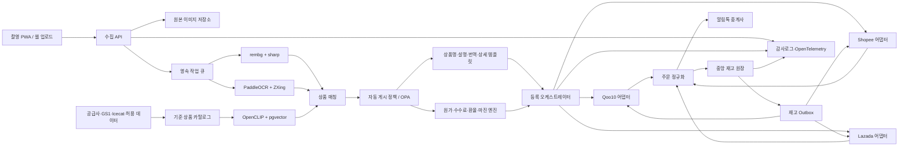

# 무인 상품등록 자동화 구축 검토 및 실행계획

> 운영 사실(연결·IP·배포 SHA)은 [docs/현재상태.md](./현재상태.md)가 원장이다. 이 파일은 당시 기획/검수 스냅샷이다.

- 작성일: 2026-08-11
- 1차 대상: Qoo10 Japan, Shopee, Lazada
- 입력 범위: 프로그램에서 촬영 이미지 업로드
- 운영 목표: 업로드 이후 사람이 매번 승인하지 않아도 시스템이 자동 등록·자동 제외·재촬영 요청 중 하나를 결정
- 제외 범위: 개인 카카오톡 대화 수집, 물리 포장·출고(3PL 연동 전), 허가되지 않은 우회 크롤링

## 1. 최종 결론

이 프로젝트는 구축 가능하다. 다만 성공 조건은 “모든 사진을 반드시 게시”가 아니라 아래처럼 정의해야 한다.

1. 등록 조건을 모두 만족한 상품은 자동 게시한다.
2. 상품 식별이 불확실하면 자동으로 추가 촬영을 요청한다.
3. 필수 속성·인증·규제 정보가 없으면 자동 제외한다.
4. 목표 마진 미달이면 자동 제외하거나 가격을 마진 하한선으로 올린다.
5. 채널 장애 시 작업을 잃지 않고 재시도하고, 중복 등록은 막는다.

이 정의를 따르면 촬영 이후 운영자의 반복 클릭을 없애는 실질적인 무인 운영이 가능하다. 반대로 임의의 사진 한 장을 무조건 100% 정확히 식별하고 모든 상품을 게시하는 목표는 오픈소스를 사용해도 달성할 수 없다.

## 2. 현재 코드베이스 판정

현재 저장소는 운영 시스템이 아니라 화면 검증용 프런트엔드 데모다.

- `app/page.tsx`의 상품 후보, 최저가, 수수료, 환율과 채널 상태는 고정 예시값이다.
- AI 분석은 타이머로 상태만 바꾸며 OCR·이미지 검색·LLM 호출이 없다.
- `db/schema.ts`는 비어 있다.
- Cloudflare D1/R2 바인딩은 연결되지 않았다.
- 실제 Qoo10/Shopee/Lazada 인증, 상품등록, 주문수집, 재고 동기화 작업자가 없다.

따라서 현재 UI는 유지하되, 운영 백엔드와 AI 작업자를 새로 구축해야 한다.

## 3. 권장 구축 원칙

### 3.1 오픈소스가 담당할 부분

- 이미지 리사이즈·합성·배경 제거
- OCR과 바코드 인식
- 이미지 임베딩과 내부 카탈로그 유사검색
- 중앙 상품·주문·재고 원장
- 영속 작업 큐와 재시도
- 컴플라이언스 규칙 실행
- 로그·메트릭·분산 추적
- 선택적으로 로컬 번역·로컬 VLM/LLM

### 3.2 반드시 직접 개발할 부분

- Qoo10/Shopee/Lazada 채널 어댑터
- 채널별 카테고리·속성·이미지·옵션 매핑
- 수수료·배송비·세금·환율을 반영한 가격 엔진
- 채널 간 중앙재고 원장과 중복·순서 제어
- 상품 식별 신뢰도와 자동 게시 정책
- 채널 API 변경을 검출하는 계약 테스트

### 3.3 외부 계약 또는 공식 서비스가 필요한 부분

- 각 판매자 계정의 개발자 앱 권한과 토큰
- Kakao 알림톡 비즈니스 채널·발신프로필·템플릿 승인 및 공식 중계사
- 공급사 상품 피드 또는 상용 상품 데이터
- 대량 GTIN 검증이 필요할 경우 GS1 기업용 조회
- 오픈소스 번역 품질이 부족한 국가의 상용 번역/LLM API

오픈소스는 데이터가 들어온 다음의 처리비용과 개발량을 줄여준다. 접근 권한이 없는 경쟁사 데이터나 판매자 계정 권한을 만들어 주지는 않는다.

## 4. 권장 오픈소스 구성

| 영역 | 후보 | 라이선스/상태 | 채택안 |
|---|---|---|---|
| 배경 제거 | [rembg](https://github.com/danielgatis/rembg) | 코드 MIT, 사용 모델 가중치별 별도 확인 | 1차 채택. 사람·제품 경계가 약한 상품은 원본 유지 |
| 이미지 변환 | [sharp](https://github.com/lovell/sharp) | Apache-2.0 | 채택. 채널별 크기·여백·포맷·품질 변환 |
| OCR | [PaddleOCR](https://github.com/PaddlePaddle/PaddleOCR) | Apache-2.0, 다국어 OCR | 채택. 라벨·브랜드·모델·용량·성분 텍스트 추출 |
| 바코드 | [ZXing-C++](https://github.com/zxing-cpp/zxing-cpp) 또는 WASM 바인딩 | Apache-2.0 | 채택. EAN/UPC/Code128/QR 우선 인식 |
| 이미지 임베딩 | [OpenCLIP](https://github.com/mlfoundations/open_clip) | 코드 오픈소스, 체크포인트별 라이선스 확인 | 채택 후보. 선택 가중치는 상업 이용 가능 여부 고정 |
| 벡터 검색 | [pgvector](https://github.com/pgvector/pgvector) | PostgreSQL License | 채택. 내부에 수집한 상품 후보만 검색 |
| 관계형 DB | PostgreSQL 또는 관리형 Supabase Postgres | PostgreSQL/관리형 서비스 | 채택. 중앙 원장과 감사로그의 기준 DB |
| 작업 큐 | [pg-boss](https://github.com/timgit/pg-boss) | MIT, PostgreSQL 기반 | 1차 권장. DB 트랜잭션과 작업 생성을 함께 처리 |
| 작업 큐 대안 | [Supabase Queues](https://supabase.com/docs/guides/queues) | 관리형 pgmq | Supabase 종속을 허용할 때 대안 |
| 정책 엔진 | [Open Policy Agent](https://www.openpolicyagent.org/docs) | Apache-2.0, CNCF | 규제·카테고리·자동게시 규칙이 늘어나는 2차에 채택 |
| 관측성 | [OpenTelemetry JS](https://github.com/open-telemetry/opentelemetry-js) | Apache-2.0 | 채택. 한 상품의 전체 처리 경로 추적 |
| 로컬 번역 | [Argos Translate](https://github.com/argosopentech/argos-translate) | MIT/CC0 | 장애 시 폴백·초안용. 상품페이지 최종 품질은 별도 벤치마크 |
| 로컬 LLM/VLM | [Qwen3.6](https://github.com/QwenLM/Qwen3.6) 계열 + [vLLM](https://github.com/vllm-project/vllm) | Apache-2.0 후보 | 2차 선택지. 1차는 공급자 추상화 후 품질/비용 벤치마크 |
| 범용 커머스 코어 | [Medusa](https://github.com/medusajs/medusa) | MIT | PoC 비교만. 목표 채널 어댑터가 없어 1차 기본안에서는 제외 |
| 시각적 워크플로 | [n8n](https://github.com/n8n-io/n8n) | OSI 오픈소스가 아닌 fair-code | 핵심 주문·재고 처리에는 사용하지 않음. 내부 보고·운영 보조만 검토 |

### 오픈소스 사용 조건

1. 모든 패키지와 모델 버전을 고정하고 lockfile을 커밋한다.
2. 코드 라이선스와 모델 가중치 라이선스를 별도로 기록한다.
3. SBOM과 라이선스 목록을 릴리스 산출물로 만든다.
4. 모델을 교체할 수 있도록 OCR·임베딩·LLM 인터페이스를 분리한다.
5. 커뮤니티 Shopee SDK 등은 공식 문서와 라이브 테스트로 검증한 뒤 일부만 사용한다. 서명·토큰·요청 직렬화는 자체 테스트를 둔다.

## 5. 상품을 찾는 데이터 전략

크롤링을 핵심 의존성에서 제거하고, 다음 순서로 후보를 찾는다.

| 우선순위 | 데이터 | 용도 | 한계 |
|---|---|---|---|
| 1 | 공급사 CSV/API, 제조사 카탈로그 | 정확한 원가·GTIN·모델·성분·인증 | 거래처 협조 필요 |
| 2 | 내부 판매 이력과 기존 등록상품 | 가장 정확한 재등록·유사상품 후보 | 초기에는 데이터가 적음 |
| 3 | [Verified by GS1](https://www.gs1.org/services/verified-by-gs1) | GTIN 유효성·소유회사·일부 상품 확인 | 무료 조회량 제한, 기업 API는 계약 가능성 |
| 4 | [Open Icecat](https://icecat.com/structured-data-content-users/) | 브랜드 승인 상품 설명·규격·이미지·다국어 | 브랜드·카테고리 커버리지 제한 |
| 5 | [Open Food Facts](https://openfoodfacts.github.io/openfoodfacts-server/api/) | 식품 바코드·성분·영양 정보 보조 | 사용자 제공 데이터, 정확성 보장 없음, 라이선스 준수 필요 |
| 6 | [eBay Browse API](https://www.developer.ebay.com/api-docs/buy/static/api-browse.html) | 이미지·GTIN 기반 후보 탐색 보조 | 대상 마켓의 최저가가 아니며 이미지 검색 지원 국가 제한 |
| 7 | 허용된 제휴 API 또는 상용 가격 데이터 | 목표 채널 경쟁가 | 비용·계약·국가별 범위 확인 필요 |
| 8 | 약관 검토가 끝난 공개 페이지 수집 | 마지막 보조 신호 | 차단·정책변경·법률 위험, 등록 필수 기능으로 사용 금지 |

### 최저가 기능의 안전한 정의

- “인터넷 전체 절대 최저가”가 아니라 `조회 가능한 승인 데이터 범위의 최저 총구매가`로 정의한다.
- 상품가뿐 아니라 배송비, 옵션, 쿠폰 적용 조건, 통화, 세금, 재고 상태를 함께 저장한다.
- 조회시각과 원본 URL을 가격 스냅샷에 남긴다.
- 경쟁가가 없더라도 마진 공식으로 가격을 계산해 등록할 수 있게 한다.
- 경쟁 최저가가 마진 하한보다 낮으면 가격을 따라가지 않고 자동 제외한다.

이 폴백 때문에 경쟁가 데이터 제공자가 일시 중단돼도 상품등록·주문·재고 운영은 계속된다.

## 6. 목표 시스템 구조



### 배포 권장안

- 현재 Cloudflare 기반 화면은 촬영 PWA와 운영 대시보드로 유지한다.
- 실제 채널 API 작업자는 고정 공인 IP가 있는 장기 실행 서버/컨테이너에 둔다. Lazada는 앱 IP 화이트리스트 설정이 가능하므로 서버리스의 변동 출구 IP에 의존하지 않는다.
- 데이터베이스는 PostgreSQL을 사용한다. 관리 편의가 중요하면 Supabase Postgres·Storage·Auth를 사용하고, 벤더 독립성이 중요하면 일반 관리형 PostgreSQL과 S3 호환 저장소를 사용한다.
- AI 작업자는 Python 컨테이너로 분리한다. 초기 저용량은 CPU로 시작하고 실제 처리시간 측정 후 GPU를 켠다.
- 채널 인증키와 `service_role` 같은 비밀값은 브라우저에 절대 전달하지 않는다.
- Supabase 사용 시 노출 스키마의 모든 테이블에 RLS를 적용하고, 내부 원장·토큰·주문 PII는 비공개 스키마에 둔다.
- 현재 Supabase 정책상 새 테이블의 Data API 노출은 자동이 아닐 수 있으므로 명시적 GRANT와 RLS를 각각 검증한다.

## 7. 촬영부터 자동 판정까지

### 7.1 촬영 방식

한 장도 허용하지만 앱은 다음 세 장을 안내한다.

1. 제품 정면
2. 뒷면 또는 성분·규격 라벨
3. 바코드·모델번호 확대

촬영 즉시 흔들림, 노출, 반사, 잘림, 해상도를 검사한다. 품질이 기준 미달이면 업로드를 완료시키지 않고 바로 재촬영을 안내한다.

### 7.2 식별 우선순위

1. GTIN/EAN/UPC 완전 일치
2. 제조사 + 모델번호 완전 일치
3. 브랜드 + 제품명 + 용량/색상/옵션 일치
4. OCR 토큰 + 이미지 임베딩 유사도
5. VLM이 제안한 후보를 위 증거로 재검증

VLM의 단독 추측으로 브랜드, 성분, 인증, 용량을 확정하지 않는다.

### 7.3 초기 자동화 게이트

- `G0`: 바코드와 공급사/공식 카탈로그가 일치하고 충돌 없음 → 자동 진행
- `G1`: 바코드가 없지만 검증 데이터셋에서 보정된 확률 97% 이상, 1·2위 후보 차이가 충분하고 모든 핵심 속성이 일치 → 자동 진행
- `G2`: 85~97% 또는 옵션·용량 충돌 → 자동 재촬영 요청, 게시 안 함
- `G3`: 85% 미만, 금지·인증 필요, 필수 속성 부족 → 자동 제외

97%는 영구 고정값이 아니라 실상품 정답 데이터 500건 이상으로 보정한 후 카테고리별로 조정한다.

## 8. 썸네일·상세페이지·번역

### 썸네일

1. EXIF 방향 보정
2. 제품 마스크 생성
3. 흰 배경 또는 채널 템플릿 합성
4. 채널별 크기·여백·파일용량 변환
5. 원본과 결과의 OCR 텍스트 비교
6. 제품 마스크 내부의 픽셀 변경량 검사

기본 썸네일은 생성형 AI가 제품 자체를 다시 그리지 않는다. 생성형 배경이 필요하면 제품 마스크 바깥 영역에만 적용한다. 라벨·로고·색상이 달라지면 결과를 폐기하고 결정론적 흰 배경 버전을 사용한다.

### 상세페이지와 설명

- 기준 데이터는 구조화된 `ProductFacts` JSON으로 고정한다.
- LLM은 사실을 새로 만드는 것이 아니라 허용된 필드만 재구성한다.
- 카테고리·채널·국가별 JSON Schema로 출력값을 검증한다.
- 브랜드, 모델, 용량, 원산지, 성분, 인증번호는 보호필드로 두어 LLM이 수정하지 못하게 한다.
- 국내형 세로 상세페이지와 해외형 정사각 이미지+bullet 템플릿을 분리한다.
- 번역은 용어집, 금지표현, 단위 변환, 역번역 차이 검사를 통과해야 한다.
- Argos Translate는 폴백으로 두고, 한국어↔일본어·영어·말레이어·태국어 등은 실제 200문장 벤치마크 후 상용 API 또는 로컬 모델을 선택한다.

## 9. 가격·마진 엔진

모든 금액을 판매 통화로 환산한 뒤 가격을 역산한다.

```text
최소 판매가 =
  (매입원가 + 국제배송 + 현지배송 + 포장/3PL + 고정수수료
   + 고정 관세·통관비 + 반품·분실 충당금)
  / (1 - 플랫폼수수료율 - 결제수수료율 - 매출연동세율
       - 광고/쿠폰 부담률 - 목표마진율)
```

필수 설계:

- 수수료 규칙은 채널·국가·카테고리·판매자 등급·적용기간별 버전으로 저장한다.
- 관세처럼 금액에 붙는 비용과 VAT처럼 판매가 비율로 붙는 세금을 분리한다.
- 환율은 출처와 기준시각을 저장하고, 실패 시 최근 확정 환율을 사용하되 오래되면 가격 갱신을 중지한다.
- 국가·채널별 반올림, 최소가격, 가격구간 제한을 적용한다.
- 가격은 `마진 하한`, `시장 참고가`, `채널 제한`을 함께 만족해야 한다.
- 가격 변동 폭과 빈도를 제한해 재가격 책정이 진동하지 않게 한다.
- 모든 가격 결정에 입력값과 계산식을 감사로그로 남긴다.

## 10. 중앙재고·주문 구조

### 재고 원장 이벤트

- `RECEIPT`: 입고
- `SALE_PENDING`: 주문 접수 예약
- `SALE_CONFIRMED`: 결제/판매 확정
- `CANCEL_RELEASE`: 취소로 예약 해제
- `RETURN_RECEIVED`: 검수 후 반품 재입고
- `ADJUSTMENT`: 실사 보정
- `SAFETY_STOCK_CHANGE`: 안전재고 변경

```text
판매가능재고 = 실재고 - 예약재고 - 안전재고
채널표시재고 = min(판매가능재고, 채널별 표시 상한)
```

### 주문 처리

1. Shopee/Lazada webhook을 수신하고 서명을 검증한다.
2. webhook 유실에 대비해 주문 API를 주기 조회한다.
3. Qoo10은 주문 API를 주기 조회한다.
4. `채널 + 주문번호 + 주문라인`으로 중복을 제거한다.
5. 하나의 DB 트랜잭션에서 주문 저장, 재고 예약, outbox 생성까지 완료한다.
6. 채널별 재고 작업자가 버전 번호와 멱등성 키로 업데이트한다.
7. 실패 시 지수 백오프로 재시도하고, 오류 유형별 재시도 상한을 둔다.
8. 15분마다 중앙재고와 각 채널 재고를 대조한다.

### 운영 목표

- webhook 주문 수신: P95 60초 이내
- polling 채널 주문 발견: 설정 주기 이내
- 재고 전파: P95 5분 이내, 단 채널 자체 화면 반영 지연은 별도 표시
- 10,000건 동시 주문 시뮬레이션에서 중앙 원장 음수 재고 0건
- 채널 장애 24시간 후 재처리해도 중복 차감·중복 등록 0건
- 초기 안전재고: SKU당 1~2개 또는 판매속도 기반 동적 버퍼

외부 3개 플랫폼을 하나의 원자적 트랜잭션으로 묶을 수는 없으므로 “모든 화면에 정확히 같은 초에 30개”는 목표로 두지 않는다. 중앙 원장이 정답이고 외부 채널은 최종적으로 수렴하게 만든다.

## 11. 채널 어댑터 표준

각 채널은 동일한 내부 인터페이스를 구현한다.

```text
authorize / refreshToken / revoke
getCapabilities
getCategories / getAttributes / validateProduct
uploadImages
createListing / updateListing / unlistListing
updatePrice / updateStock
listOrders / getOrder / acknowledgeOrder
getShippingParams / markShipped
verifyWebhook / normalizeWebhook
healthCheck
```

### 채널별 구현 원칙

- Qoo10: QAPI를 직접 호출한다. 신규 기본상품 등록 뒤 이미지·상세·옵션·가격·재고를 보완하는 단계형 작업으로 만든다. 주문은 polling한다.
- Shopee: Global Product와 국가별 publish task를 분리한다. 국가 shop 토큰 갱신, push 중복, 옵션별 stock 제한을 테스트한다.
- Lazada: 이미지 업로드/이관 후 Lazada URL을 상품 요청에 넣는다. 앱 IP whitelist, 서명, 토큰, 창고별 수량을 분리한다.
- 커뮤니티 SDK는 요청 서명과 타입 참고용으로만 시작하고, 실제 운영 endpoint는 공식 문서·실계정 응답을 고정 fixture로 저장해 계약 테스트한다.

라이브 상품 생성 테스트는 사용자 승인 없이 실행하지 않는다. sandbox가 없는 채널은 테스트용 판매자 계정 또는 최소재고·비노출 절차를 별도로 합의한다.

## 12. 컴플라이언스와 완전 무인 정책

### 1차 자동 게시 허용 범위

- 인증·성분 신고가 필요하지 않은 저위험 카테고리
- 공급사에서 필수 속성과 원산지·제조자 정보를 받은 상품
- 브랜드 판매권한 문제가 없는 상품
- 채널 금지어·금지이미지·금지상품 규칙을 통과한 상품

### 자동 제외 범위

- 의약품, 의료기기, 건강기능 표현
- 성분표·인증서가 없는 화장품/식품/유아용품 등 규제 가능 상품
- 배터리·전파·안전인증이 필요한데 인증 데이터가 없는 상품
- 위조 가능 브랜드, 타 판매자 워터마크, 권리 불명확 이미지
- 원산지·제조자·용량·옵션 등 채널 필수값 누락

화장품을 1차에 반드시 포함하려면 사진만으로 처리하지 않고, 공급사 피드에 전성분·책임판매업자·제조국·사용기한·인증/신고 자료를 연결해야 한다. 자료가 없으면 시스템이 자동 제외한다.

OPA 도입 전에는 버전 관리되는 JSON 정책과 테스트 케이스로 시작하고, 국가·카테고리 규칙 수가 증가하면 OPA로 이전한다.

## 13. 카카오 알림

- 개인 카카오톡 대화는 읽지 않는다.
- 주문접수, 결제완료, 재고오류, 등록실패, 마진하락 등 시스템 이벤트만 발송한다.
- 알림톡 중계사 어댑터를 만들어 중계사를 교체할 수 있게 한다.
- 템플릿 심사 전에는 이메일 또는 SMS 폴백을 사용한다.
- 주문자 이름·주소 등 불필요한 개인정보는 알림 본문에 넣지 않는다.

## 14. 핵심 데이터 모델

- `product_intakes`: 촬영 업로드 단위와 처리상태
- `source_assets`: 원본·파생 이미지, 해시, OCR 결과
- `catalog_products`, `product_variants`, `product_identifiers`: 기준 상품과 GTIN/MPN
- `match_candidates`, `match_evidence`: 후보와 판단 근거
- `product_facts`: 보호된 상품 사실 JSON
- `content_artifacts`: 언어·채널별 상품명/설명/이미지
- `channel_accounts`, `channel_tokens`: 채널 계정과 암호화 토큰
- `listings`, `listing_attempts`: 외부 상품번호와 모든 시도
- `inventory_items`, `inventory_ledger`, `inventory_reservations`: 중앙재고 원장
- `orders`, `order_lines`, `order_events`: 정규화 주문
- `cost_profiles`, `fee_rules`, `fx_quotes`, `price_decisions`: 가격 근거
- `policy_decisions`: 자동 게시·제외 결정과 규칙 버전
- `jobs`, `outbox_events`, `webhook_events`: 재시도·중복방지
- `audit_logs`: 누가/무엇이/언제/왜 변경했는지 기록

주문주소와 연락처는 별도 PII 테이블에 두고 접근권한·암호화·보존기간을 다르게 적용한다.

## 15. 단계별 실행계획

전체 예상: Gate 1 통과 후 일부 작업을 병행하는 4~5명 팀 기준 20~28주이며, 모든 단계를 순차 수행하면 25~34주다. API 승인·상품 데이터 계약·카테고리 규제 범위에 따라 변동한다.

### Gate 0 — 범위와 데이터 확정 (2주)

- 1차 국가: Qoo10 JP, Shopee 1개국, Lazada MY로 고정
- 1차 허용 카테고리와 금지 카테고리 확정
- 실제 판매상품 100개와 촬영이미지 수집
- 공급사 원가·GTIN·모델·성분 데이터 확보율 측정
- 알림톡 발신프로필·템플릿 신청
- 완료 기준: 테스트 상품과 정답 데이터, 계정 권한, 자동 제외 정책이 문서화됨

### Gate 1 — 3채널 API PoC (3~6주)

- 인증·토큰 갱신
- 카테고리/속성 조회
- 이미지 업로드
- 상품 생성·수정·판매중지
- 가격·재고 수정
- 주문 조회/webhook과 배송 상태
- rate limit·오류·토큰 만료 fixture 수집
- 완료 기준: 각 기능을 실계정 또는 sandbox에서 반복 실행하고 결과가 DB 감사로그에 남음

Gate 1에서 특정 채널의 필수 API 권한을 받지 못하면 해당 채널은 UI 자동화로 우회하지 않고 범위에서 보류한다.

### Phase 1 — 운영 코어 (6~8주)

- PostgreSQL 스키마, 중앙 상품·재고·주문 원장
- pg-boss 작업 큐, outbox, 멱등성, 재시도
- 3채널 어댑터의 상품·가격·재고·주문 기능
- 알림톡/이메일 알림
- 운영 대시보드의 mock 데이터를 실제 API 데이터로 교체
- 완료 기준: 10,000건 동시 주문 시뮬레이션, 24시간 장애 복구, 중복 등록·중복 차감 0건

### Phase 2 — 이미지·콘텐츠·가격 (5~7주)

- 촬영 품질 검사와 다중 사진 업로드
- ZXing, PaddleOCR, rembg, sharp 파이프라인
- ProductFacts, 국가/채널별 콘텐츠 템플릿
- 번역 공급자 추상화와 용어집
- 수수료·환율·세금·마진 가격 엔진
- 완료 기준: 원본 라벨 보호 테스트 통과, 계산식 property test 통과, 채널별 필수값 누락 게시 0건

### Phase 3 — 상품 매칭·시장 데이터 (5~7주)

- 공급사/내부 카탈로그 수집
- GS1/Icecat/Open Food Facts 등 카테고리별 커넥터
- OpenCLIP + pgvector 하이브리드 검색
- 후보 재랭킹과 신뢰도 보정
- 승인된 가격 데이터 스냅샷
- 완료 기준: 정답 500건 이상에서 카테고리별 정확도·오탐률 보고서 제출, G0/G1 자동게시 기준 확정

### Phase 4 — 제한적 무인 운영 (4주)

- 화이트리스트 SKU 30~100개로 실제 운영
- 안전재고와 polling 주기 조정
- 자동 등록·제외·재촬영 비율 측정
- 채널 거부사유를 규칙과 속성 매핑에 반영
- 장애 알림과 runbook 검증
- 완료 기준: 4주간 중대 과판매·중복상품·무근거 보호필드 생성 0건, 목표 등록 성공률 달성

## 16. PoC 완료 기준

### 채널별

- 토큰 만료 후 자동 갱신 또는 재인증 알림
- 동일 요청 재실행 시 중복 상품 생성 방지
- 이미지·옵션·속성·가격·재고 생성 및 수정
- 주문 중복 webhook/polling에도 주문 1건만 생성
- API 429/5xx/timeout 후 안전 재시도
- 채널 응답과 내부 요청을 민감정보 제거 후 감사로그 저장

### AI/이미지

- 바코드가 있는 정답 세트의 GTIN 오인식률 측정
- OCR 보호필드의 문자 정확도 측정
- 제품 마스크 내부 라벨·로고·색상 변조 검출
- 이미지 매칭 Top-1/Top-5와 오탐률을 카테고리별 보고
- 신뢰도 미달 상품이 자동 게시되지 않음

### 가격/재고

- 음수 재고 불가 DB 제약
- 동일 주문의 중복 차감 불가
- 가격 분모가 0 이하이거나 마진 불가능하면 자동 제외
- 환율·수수료 규칙이 오래되면 자동 가격 변경 중지
- 경쟁가가 사라져도 마진 기준 등록은 정상 동작

## 17. 우회수단과 폴백

| 실패 상황 | 자동 처리 |
|---|---|
| 바코드 미검출 | OCR+이미지 검색으로 전환 |
| 상품 후보가 여러 개 | 뒷면/바코드 재촬영 요청 |
| 경쟁가격 데이터 없음 | 원가·마진 기반 가격만 사용 |
| 번역 API 장애 | 캐시 또는 로컬 번역 초안 사용, 품질 게이트 미달 시 게시 보류 |
| 배경 제거 실패 | 원본 비율 유지+흰 여백 썸네일 생성 |
| 한 채널 등록 실패 | 성공 채널은 유지하고 실패 채널만 재시도 |
| 주문 webhook 유실 | polling으로 보정 |
| 재고 업데이트 실패 | 안전재고 확대·재시도·긴급 알림 |
| 규제 정보 부족 | 자동 제외, 판매금지 상태 유지 |
| 채널 API 변경 | 계약 테스트 실패 후 해당 기능 circuit breaker 작동 |

## 18. 보안·운영 필수조건

- 채널 토큰과 API 비밀키는 암호화 저장하고 브라우저·로그에 노출하지 않는다.
- webhook 서명 검증, replay 방지, 시간창 검증을 적용한다.
- Supabase를 쓰면 모든 노출 테이블 RLS, 비공개 스키마 분리, service key 서버 전용을 강제한다.
- 역할별 권한, 중요 작업 감사로그, 관리자 MFA를 적용한다.
- 주문 PII 보존·마스킹·삭제 정책을 국가와 채널 약관에 맞춘다.
- 의존성 버전 고정, 취약점 스캔, 모델/데이터 라이선스 대장을 유지한다.
- 채널별 성공률, 429, 인증 오류, 주문 지연, 재고 불일치를 대시보드와 알림으로 감시한다.
- API 변경 대응과 정책 업데이트를 월 유지보수 범위에 포함한다.

## 19. 확정 권장안

1. 기존 UI는 촬영 PWA와 운영 대시보드로 재사용한다.
2. Cloudflare D1을 중앙 원장으로 쓰지 않고 PostgreSQL을 사용한다.
3. Medusa 같은 전체 커머스 프레임워크를 바로 도입하지 않고, 필요한 도메인만 작은 코어로 구현한다.
4. 1차 큐는 pg-boss, 검색은 pgvector, 이미지 처리는 rembg+sharp, OCR은 PaddleOCR, 바코드는 ZXing을 사용한다.
5. 생성형 AI는 상품 사실을 만들지 못하게 하고 콘텐츠 표현과 번역에만 사용한다.
6. 경쟁가 수집은 독립 모듈로 두어 없어도 등록·주문·재고가 동작하게 한다.
7. 1차 카테고리는 저위험 화이트리스트로 시작한다. 화장품 등은 공급사 규제 데이터가 연결된 상품만 허용한다.
8. 3개 채널 실제 API PoC가 통과하기 전에는 전체 고정가 개발계약을 체결하지 않는다.
9. 라이브 상품 게시 테스트는 별도 승인 전까지 수행하지 않는다.

이 구조가 현재 요구사항을 “가능한 시스템”으로 바꾸는 핵심이다. 오픈소스로 처리 엔진과 운영 기반을 확보하고, 채널별 공식 API와 데이터 권한이 필요한 부분은 명시적으로 분리한다. 데이터가 부족한 상황에서는 억지 등록이 아니라 자동 제외 또는 재촬영으로 종료해 무인 운영의 안전성을 유지한다.
