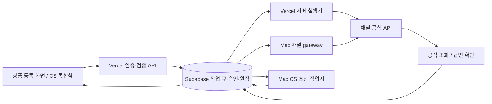

# 채널 등록·CS·Vercel/Mac·1차 이미지 검토

검토 시각: 2026-09-13 00:18 KST 이후. 검토 소스: `57bc85f3c4fba42d482c3ea9435ad29aed81a559`. 개발 위치는 `/Users/kimchangheemac/dev/sellerpilot-app`이다. 이번 작업은 코드·설정·로그 조회와 격리된 함수 재현이며, 상품 등록·CS 발송·DB 변경·운영 재배포·작업자 재시작은 수행하지 않았다.

## 결론

1차 6장의 역할 ID와 Mac 카테고리 매칭은 존재한다. 그러나 최초 6장은 기본적으로 원본 사진의 크기·위치·여백·배경색을 바꾸는 카탈로그 이미지이며, 별도 Mac 재생성도 2차 이미지의 전체 품질 검증을 공유하지 않는다. 화면은 실제 재생성 여부를 확인하지 않고 동일 품질로 완료됐다고 표시할 수 있다. 같은 화면에서 다음 상품의 6장 생성 요청이 누락되는 문제도 재현했다.

8채널 모두 상품 CREATE/UPDATE/공식 조회 실행 코드가 있지만, 서버와 Mac 모두 해당 작업의 자격증명·승인·실행 권한이 필요하다. Temu CS 답변은 명시적으로 미지원이다. 현재 Mac gateway는 `ready:false`이고 CS 결과 저장 503이 관측됐다. 따라서 코드 지원을 현재 8채널 연결 완료로 판단하면 안 된다.

## 현재 상태: 확인한 사실과 미확인 범위

| 항목 | 이번에 확인한 상태 |
| --- | --- |
| 전역/프로젝트 지침 | 전역 AGENTS, 통합·옛 dev·옛 Documents의 AGENTS, 메모리 추가 노트 총 5개에 통합 경로 기록 확인. 전역 override 없음. `check:workspace` 통과 |
| Codex 저장 프로젝트 | 앱 `list_projects`는 여전히 옛 Documents 경로를 반환. 지침 저장과 앱 시작 전 Worktree 생성 차단은 다르며, 새 채팅 실제 생성 검증은 안 함 |
| Vercel Production | Vercel REST API로 `dpl_Fkbk9Kyg9whytrri5pUcG5PQkjUm`, `READY`, `fd426cc588f03c1e187b689141018b6de4a38eca` 재확인 |
| 통합 Preview | `dpl_HiC8Htb9gypJoKqQRXwAAKw35Qnm`, `BLOCKED`, 소스 `2f5aafd`; 현재 통합 HEAD가 운영 배포된 상태가 아님 |
| Vercel 실행 설정 | Production 프로젝트 설정의 `SELLERPILOT_SERVERLESS_STATIC_EGRESS_CHANNELS=elevenst,smartstore`. 프로젝트 설정값 확인이며 배포 프로세스의 유효 값/DB 허용/판매자 성공을 증명하지 않음 |
| Mac gateway | `com.sellerpilot.channel-gateway`, 실제 자식 PID 30285, 독립 런타임 `~/dev/sellerpilot-worker`, SHA `fd426cc`. `/readyz`는 `degraded`, `ready:false`, 처리 중 1건, scheduler 꺼짐. 마지막 gateway contact는 00:14:27 KST였고 이후 loop는 계속 갱신됨 |
| Mac CS 저장 | 해당 gateway의 `channel-gateway-error.log`에서 CS 결과 저장 HTTP 503과 동일 결과 재시도 확인. provider 답변 실패/성공 여부까지는 이 로그로 알 수 없음 |
| 중복 supervisor | 별도 PID 42249가 `worker-runner.log`에 `SELLERPILOT_URL must explicitly identify...` 오류와 재시작을 반복. 정상 launchd supervisor PID 30270과 파일 디스크립터로 구분함. 정상 launchd plist에는 URL이 있으므로 정상 설정까지 누락됐다고 일반화하지 않음 |
| Mac 이미지 | AI launchd 실행 중, `FIRST_DRAFT_IMAGES=1`; 아래 주요 이미지 소스 5개가 설치된 AI 런타임과 바이트 일치. 실행 중이라는 사실만으로 최근 이미지 생성 성공을 증명하지 않음 |
| CS 초안 | `scripts/cs-draft-worker.mjs`는 별도 `/api/cs/worker/drafts` 큐를 사용. 이번 프로세스·launchd 점검에서는 별도 CS 초안 상주 실행을 확인하지 못함 |
| 운영 DB | Supabase 연결 도구의 상태 RPC 조회가 권한 부족으로 거부됨. Vercel의 sensitive DB 키도 조회 응답에 원문이 없어 이를 이용한 DB 조회는 진행하지 못함. 채널별 현재 승인·만료·큐·CS 건수·cron 활성 상태는 미확인 |

## 공통 연결 구조

Vercel은 화면만 담당하는 것이 아니다. 지원되는 provider API도 실행한다. Mac은 자신의 로그인·Codex/Swift·관측 IP 또는 별도 로컬 실행 승인이 필요한 작업을 맡는다. `/api/internal/channel-gateway-drain`은 현재 `serverless-gateway.ts`를 사용하며 `maxDuration=300`이다. 이름이 비슷한 과거 CS 모듈이나 문서만 보고 현재 실행 경로를 판단하지 않았다.

등록은 요청/승인 → 큐 → 실행 → 공식 상품 조회 → 내부 등록 원장의 흐름이다. CS는 수집 → 정규화·중복 제거 → 통합함 → 초안/검토 → 답변 큐 → provider 답변 → 확인/원장의 별도 흐름이다. CS 초안 생성과 답변 전송도 별개다. `HTTP 202`, `running`, 작업자 Online은 완료 근거가 아니다.

## 채널별 등록·CS 실행 위치

표의 **Vercel 조건부**는 코드상 실행 가능하고 현재 프로젝트 설정에 해당 채널이 있거나 static-egress 예외라는 뜻이다. DB 허용, 활성 릴리스, seller/account 결속, 실제 승인·자격증명이 확인된 뜻은 아니다. **Mac 일반 큐**도 DB claim 정책에 따라야 하며 자유로운 우회 경로가 아니다.

| 채널 | 상품 등록·조회 | CS 수집 범위 | CS 답변 / 로컬 연결 |
| --- | --- | --- | --- |
| 쿠팡 | CREATE/UPDATE/공식 조회 코드 있음. 현재 Vercel static-egress 설정에 없어 서버 실행 제한. Mac 승인 전용 큐는 CREATE·가격 변경·일부 조회를 허용 | 상품문의, 고객센터, 반품·취소·교환 요청 | 답변 구현 있음. Vercel 제한 시 Mac 일반 큐의 실제 허용 필요. 승인 전용 local executor 목록에는 답변이 없음 |
| 스마트스토어 | Vercel 조건부. Mac 승인 전용 CREATE/UPDATE 및 별도 조회 복구 경로 있음 | 상품문의, 고객문의, 구매자 수정 이력 | 답변 구현 있음. Vercel 조건부. Mac 문의 조회/복구 가능 범위와 답변 승인 범위는 별도 |
| 11번가 | Vercel 조건부. Mac 일반 큐 및 전용 CREATE 복구/진단 경로 있음 | 상품 Q&A, 긴급알리미 | 답변 구현 있음. 긴급알리미의 시스템 안내를 구매자 문의/답변 대상으로 보지 않음. Mac 승인 전용 큐는 문의·주문·진단 조회 |
| Qoo10 | Vercel 실행 코드 있음. CREATE는 엄격한 상품·배송·실행 전 승인 계약 필요. 기존 상품 복구를 신규 등록 완료로 계산하지 않음 | 미답변/처리 중/완료 문의, 문의 메시지 이력, 클레임 | API가 답변을 지원하는 문의만 발송·확인. 기본적으로 Vercel 경로, Mac 일반 큐는 실제 DB 허용 확인 필요 |
| Shopee | Vercel은 OAuth 교환을 제외한 지원 작업에 static-egress 예외. OAuth 교환은 Mac 전용 복구 경로 확인. 숍별 token/대상 결속 필요 | 기본 주기 수집은 상품 후기·반품/환불. Buyer Chat은 별도 ingest·수집 경로 | 후기 답변 구현 있음. Buyer Chat 전체가 기본 주기 수집·발송으로 연결됐다는 뜻은 아님. Mac 승인 전용 조회 경로도 있음 |
| Lazada | Vercel 실행 코드 있음. OAuth/숍·국가 결속 필요. Mac 승인 전용 조회 경로도 있음 | IM 세션·메시지 bootstrap과 이어받기. 후기 답변/확인은 별도 작업 경로 | IM 답변 및 별도 후기 답변/확인 코드. `inquirySyncArguments`의 빈 배열만으로 미지원이라고 하면 안 됨: scheduler가 bootstrap 요청을 별도 생성 |
| eBay | Vercel 실행 코드 있음. Mac에는 별도 게시 복구 claim 경로. 상품 공개 조회와 판매 가능 확인 필요 | 상품 ASQ, My Messages, 회원 대화, eBay 시스템 대화; case/dispute 별도 조회 | 답변 가능한 ASQ/회원 문의만 지원. 시스템 메시지/모든 mailbox 항목이 답변 가능하지는 않음 |
| Temu | CREATE/UPDATE/공식 조회 코드 있음. 현재 Vercel static-egress 설정에 없어 서버 실행 제한. Mac 일반 큐 정책 및 별도 승인 확인 필요 | 기본은 after-sales와 상세. Buyer Chat은 별도 readiness/계정 결속 경로 | **`inquiries.reply` 명시적 미지원**. Mac으로 옮겨도 같은 도메인 실행기가 거부함. 조회 성공을 CS 자동답변 완료로 취급하면 안 됨 |

근거: `lib/channels/commerce-provider.ts:39`, `lib/channels/serverless-gateway.ts:208`, `lib/channels/serverless-static-egress.ts:1`, `lib/channels/local-channel-executor.ts:12`, `scripts/channel-gateway-worker.mjs:375`, `lib/cs/operations/provider.ts:25`, `lib/cs/operations/execute.ts:241`, `lib/channels/sync-arguments.ts:44`, `lib/cs/operations/schedule.ts:38`.

주의할 수집 공백: 현재 설정을 코드에 대입하면 Vercel의 일반 CS 주기 대상에서 쿠팡·Temu가 빠지고, 확인한 Mac gateway도 `--no-scheduler`다. 별도 DB cron/수집기가 보충하는지는 확인하지 못했으므로 이 두 채널의 자동 수집 연속성을 우선 검증해야 한다. 작업자가 큐를 처리하는 기능과 새 조회 작업을 주기적으로 만드는 기능은 다르다.

배송도 같은 기준을 적용한다. 8채널 주문 목록 코드는 있지만 현재 shipping matrix에서 11번가 `orders.get`/`shipment.confirm`은 빠져 있고, 접수와 송장 확정 지원 목록도 다르다. 상품 등록 연결을 배송 전체 연결로 확장해서 보고하면 안 된다.

## 1차 6장의 분류와 품질 차이

| ID | 화면에 정의된 역할 |
| --- | --- |
| portrait | 모바일 세로 설정샷 |
| wide | 가로 설정샷 |
| detail-overview | 상품 전체·준비컷 |
| detail-use | 사용 설정샷 |
| detail-routine | 생활 루틴 설정샷 |
| detail-scale | 크기 비교 설정샷 |

`lib/ai-generated-assets.ts:408`, `app/page.tsx:270`에 위 분류가 있다. 그러나 실제 최초 이미지 생성 함수 `buildServerProductResearchSourcePhotoCatalog`는 카테고리/장소/사용 장면을 받지 않고 원본·규격·순번으로 색·크기·위치만 바꾼다. `lib/server-product-research-runtime.ts:44`는 명시적으로 `gateway-composite`를 지정하지 않으면 이 경로를 선택한다. 과거 주석의 Gateway 403만이 원인인 것은 아니며, 현재 기본 설계 자체가 원본 가공이다.

| 단계 | 카테고리/장면 계획 | 생성·품질 검사 |
| --- | --- | --- |
| 최초 Vercel 6장 | 역할 ID는 있으나 기본 생성 함수에 상품 카테고리 기반 장면 설계가 전달되지 않음 | 원본 크기·여백·위치·배경색 변경. PNG 규격·해시 중복 검사. 장면 의미의 차이는 보장하지 않음 |
| Mac 1차 재생성 | `buildFirstDraftStudioResult`와 공통 `buildAssetImagePrompt`로 카테고리·설정샷 계획 사용 | `generateFirstDraftAsset`가 원본 1장으로 제품 전체를 생성한 뒤 파일/PNG 정규화. 2차의 실제 원본 픽셀 합성·OCR 라벨 대조·시각적/의미적 중복 검수를 호출하지 않음 |
| Mac 2차 이미지·상세 | 상세 섹션·구매 질문·근거·레이아웃, 역할별/추가 원본, 상품별 설정샷 | 보호 대상 제품의 배경만 생성 후 원본 합성, 라벨 OCR·픽셀 검증, 유사도·배치 의미 중복 검사, 재생성, 상세 배치 및 결과 저장 |

Mac 1차에도 카테고리 매칭은 있다. 직접 실행한 분류 함수에서 식품/음료→`food-staples`, 스킨케어→`beauty-skincare`, 남성 상의→`men-tops`가 확인됐다. 단, 1차 분류는 `isHealthFunctionalFood:null`로 고정되므로 건강기능식품 키워드는 확인 전 `general-commerce`로 떨어진다. 이는 확인되지 않은 효능·분류를 만들지 않기 위한 제한이며, 무조건 건강기능식품 스타일로 강제하는 수정은 적절하지 않다. 사용자가 수정한 최신 상품 사실도 현재 enqueue가 jobId만 보내는 구조에서는 충분히 반영되지 않는다.

## 우선 수정할 결함

| 우선순위 | 발견 사항 / 근거 | 수정 방향 |
| --- | --- | --- |
| P1 | 원본 6장 재조회만으로 생성 완료 표시. `refreshFirstDraftImages`가 auditMode를 읽지 않고 `mergeStudioDraftImages` 호출, 이 함수가 URL 존재만으로 `studioDraftImagesMerged=true`. 원본 URL이 모두 같은 재현 입력에서 실제로 true가 됨 (`app/page.tsx:4140,4291,4489`) | jobId·생성 방식·완료 상태·검수 결과·asset digest를 확인해 원본 가공/생성 대기/부분 완료/검수 완료를 구분 |
| P1 | 다음 상품 요청 누락. 요청 여부 ref는 컴포넌트 전체 boolean이며 jobId 변경 시 초기화 없음. 동일 함수에 첫/둘째 job을 넣자 첫 job만 enqueue됨. polling도 이전 작업 ID를 계속 사용 가능 (`app/page.tsx:4138–4182`) | jobId별 요청 상태와 polling 소유권, 작업 변경/해제 시 정리, 늦은 결과 무시 |
| P1 | 1차와 2차의 실제 생성·검수 불일치. 1차는 공통 프롬프트만 재사용 (`scripts/first-draft-image-lane.mjs:77–106`), 2차는 합성/OCR/중복 검사 (`scripts/product-ai-worker.mjs:2142–2557`) | 2차 자산 생성·검수 함수를 공통 모듈로 추출해 두 단계에서 실행. 1차도 역할별 시각 검수와 원본 보존을 통과한 결과만 완료 |
| P1 | 1차 결과를 실제 원본 합성 검증 없이 `segmented-source-composite`로 기록 (`lib/first-draft-images.ts:409–418`). 업로드 라우트는 PNG 규격/해시 중심 검증 (`app/api/ai/worker/first-draft-images/route.ts:245`) | 실제 생성 방식과 검수 증거에 맞는 lineage 기록. 기존 데이터는 확인 없이 합성 검증 완료로 승격하지 않음 |
| P1 | gateway degraded 및 CS 결과 저장 503, 중복 supervisor 반복 재시작 | DB 응답/미완료 job을 먼저 조회하고 같은 결과의 안전한 완료 저장 확인. 오래된 supervisor의 소유·자식 프로세스를 확인한 후 정리. 처리 중 작업을 재등록하지 않음 |
| P1 | 쿠팡·Temu의 확인된 기본 주기 수집 경로 공백 가능성; Temu 답변 미지원 | 실제 cron/큐/계정별 수집 구간을 조회해 누락 경로를 확정. Temu UI에서는 읽기 지원과 답변 미지원을 구분 |
| P2 | 1차 studio facts에 상세 섹션/지역별 listing이 비어 있음; 최신 수동 수정값 전달 부족 (`lib/first-draft-images.ts:170–226`, admin enqueue) | 확정된 상품 사실 버전에 카테고리·장면 계획을 결속하고 2차에서 같은 계획 확장 |
| P2 | 1차 재생성/상세 자동 시작/최종 상품 원장 제작이 화면의 여러 경로에서 같은 타일을 교체함 | jobId·상품 사실 버전·단계별 한 소유자를 정해 오래된 polling이나 다른 단계의 결과가 현재 타일을 덮지 않게 함 |

첫 해결 순서는 **완료 오표시·다음 상품 누락 → 1/2차 공통 검수 → gateway/CS 저장·수집 연결 → 통합 버전 배포와 채널별 실제 확인**이 적절하다. 운영에 영향을 주는 재시작/배포 전에 처리 중 작업의 상태와 버전 정합성을 확인해야 한다.

목표 구조는 상품 사실 버전 → 카테고리·역할별 장면 계획 → 동일한 생성·검수기로 1차 6장 완성 → 사람이 확인 → 2차에서 유효한 6장을 재사용하고 추가 자산·상세 레이아웃을 완성하는 순서다. 상품 사실이나 원본이 바뀌면 영향받은 자산만 재검수/재생성한다. 원본 가공 이미지를 임시로 보여줄 수는 있지만 실제 생성·검수 완료와 같은 상태로 표시하지 않는다. 이 변경안은 아직 구현하지 않았다.

## 검증과 한계

- 단일 작업공간 검사 통과. 전역/옛/통합 경로 지침 5개 저장 상태 재확인. 앱 저장 프로젝트 경로는 옛 위치여서 완전한 UI 차단을 보장할 수 없음.
- 이미지 관련 6개 소스 파일이 현재 Production SHA의 파일과 모두 일치. 그중 설치된 Mac 런타임에 존재하는 5개도 바이트 일치. 이번 문제는 통합 폴더에만 남은 과거 코드 때문이 아님.
- 관련 테스트 58개: 54 통과, 4 실패. 기존 Production 런타임 체크아웃에서도 같은 58개 중 같은 4개 실패를 재현. 1차 이미지·이미지 계획 26개는 통과했지만 이 테스트들은 실제 이미지 품질을 검증하지 않음.
- 기존 실패: local executor whitelist 기대값, Shopee 후기/반품 멀티숍 continuation 2건, Qoo10 CREATE 가드 기대 메시지 1건. 이번 검토에서 실패를 숨기거나 테스트 기대값을 바꾸지 않음.
- 화면 완료 오표시와 두 번째 상품 요청 누락은 실제 소스에서 해당 함수를 추출·변환해 mocked 세션/통신으로 재현. 실제 판매자 계정에서 상품 생성/발송을 하지 않음.
- 특정 상품의 원본/생성 이미지 픽셀을 이번에 직접 비교하지 못했으므로 개별 결과물의 미적 점수나 불량률은 산정하지 않음. 구조·카테고리 경로·검수 생략·표시 오류는 위 코드와 재현으로 확인함.
- 로컬 증거: `outputs/workspace-unification/review-20260913-tests.log`, `review-20260913-production-baseline-tests.log`, `review-20260913-ui-probe.json`, `review-20260913-second-job-probe.json`, `review-20260913-source-comparison.json`, `review-20260913-workspace-policy.json`. 이 폴더는 Git 제외 대상이다.

플랫폼 제한은 [Vercel Functions 공식 문서](https://vercel.com/docs/functions/limitations)를 확인했다. 장시간 작업의 제약과 별개로 이 앱의 Mac 의존성에는 로그인된 Codex/Swift·원본 이미지 처리·채널별 실행 승인이 있다. 전역 지침의 적용 범위는 [Codex AGENTS.md 공식 안내](https://learn.chatgpt.com/docs/agent-configuration/agents-md)를 기준으로 구분했다.
